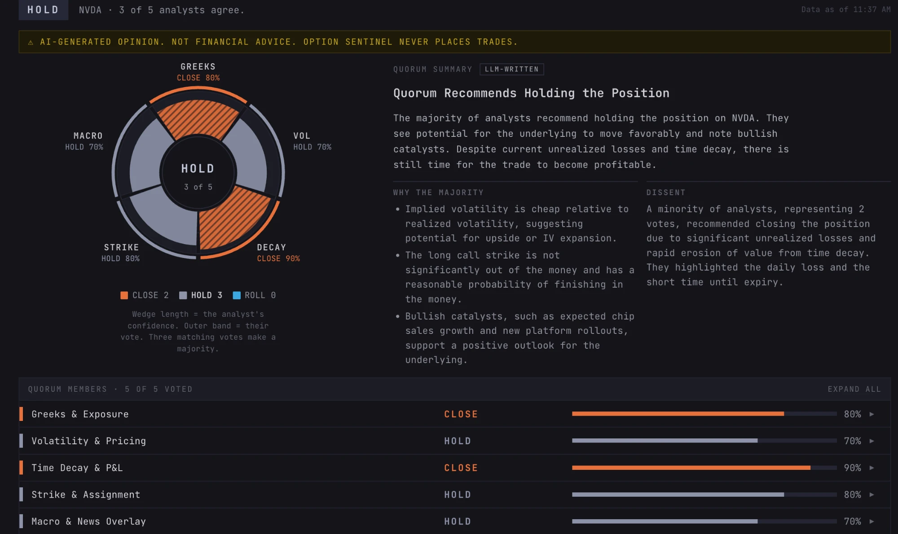

# Option Sentinel

> A personal options position monitor built with Claude Pro, spec-driven from day one.


---

## What it does

Option Sentinel connects to your Charles Schwab account and gives you a **live, visual dashboard** of every open options position — with Greeks, P&L, and the tools to make informed management decisions without hunting through the brokerage UI.

| Capability | Detail |
|---|---|
| **Live positions** | On-demand refresh from Schwab — one button, immediate update |
| **Greeks** | Delta, gamma, theta, vega, IV — sourced from Schwab API, Black-Scholes fallback |
| **Spread grouping & payoff graphs** | Legs on the same underlying and expiry collapse into one spread row; click a row for its payoff graph at today, +1 week, +2 weeks and expiration |
| **Covered call screener** | Ranks long stock positions by covered-call income opportunity, using implied volatility relative to 30-day realised volatility (IV/RV) |
| **Agentic advice (quorum)** | The **ADVICE(Agentic)** button on any position asks five Google ADK analyst agents to vote CLOSE / HOLD / ROLL: four judge its Greeks, volatility, time decay and strikes; one overlays recent CNBC / Yahoo Finance / Bloomberg news. Results show as a radial vote ring, a model-written summary and a row per analyst, and are kept for your session. Gemini on Vertex AI; no identifying data sent. [Details below](#agentic-advice-the-quorum) |
| **Mobile-ready** | Visual-first responsive dashboard — readable on your phone mid-session |
| **Erase All** | One button wipes every piece of your data from the browser instantly |


---

## Privacy & Data Handling

This section explains exactly where your data lives, how it flows, and how to erase it. No hand-waving.

### The core guarantee

> **Your Schwab token and position data never reside on the server.** The server forwards your token to Schwab and returns raw data. It stores nothing. Logs nothing sensitive.

### Login flow — step by step

```
1. You click "Connect Schwab Account"
   └─ You are redirected to Schwab's own login page (api.schwabapi.com)
      Option Sentinel never sees your Schwab username or password.

2. You log in and approve the app at Schwab
   └─ Schwab redirects you back to Option Sentinel with a one-time auth code.

3. Option Sentinel exchanges that code for a token
   └─ This step requires your App Secret and must happen server-side.
      The token is returned to your browser via an inline <script> tag
      in the callback page response.
      The server discards the token immediately after sending the response.
      The token is never written to a database, file, or log.

4. Your browser stores the token in sessionStorage
   └─ sessionStorage is tab-local — it is automatically cleared when
      you close the tab or browser. It cannot be accessed by any
      other website or browser tab.

5. Every Refresh request sends the token as an Authorization header
   └─ The server reads the header, forwards it to Schwab, returns
      the raw JSON response. It does not log the Authorization header
      value. It does not store it. It is only in memory for the
      milliseconds of that request.

6. Your browser caches position data in sessionStorage
   └─ sessionStorage is tab-local — it is automatically cleared when
      you close the tab or browser. Position data is available for
      the duration of the tab session without additional network
      requests until you click Refresh again.
```

### Where each piece of data lives

| Data | Location | Cleared when |
|---|---|---|
| Schwab token | Browser `sessionStorage` | Tab/browser closed, Logout, or Erase All |
| Cached positions (incl. calculated fundamentals and refresh time) | Browser `sessionStorage` | Tab/browser closed, or Erase All |
| Screener cache | Browser `sessionStorage` | Tab/browser closed, or Erase All |
| Quorum results (verdict, votes, summary) | Browser `sessionStorage` — first result per position | Tab/browser closed, Logout, or Erase All |
| **Server storage** | **None** | **N/A — nothing is stored server-side** |

The full list of every data use — including exactly what the quorum sends to Google Vertex AI — is in the app at **`/data-use`** (linked from the login page and navigation).

### What Cloud Run sees

Cloud Run (the server) sees:
- The URL path of each request (e.g., `/api/positions/refresh`)
- The `Authorization: Bearer` header — **value forwarded to Schwab, not logged**
- Standard HTTP metadata (timestamps, response codes)

Cloud Run never sees or stores:
- Your Schwab credentials
- Your position data at rest
- Your cached positions or saved quorum results
- Any data from a previous session

### Erase All Data

The **"Erase All Data"** button is available in the navigation on every page. Clicking it (after a confirmation prompt) runs the following in your browser:

```javascript
sessionStorage.clear()              // removes Schwab token, cached positions, screener cache, saved quorum results
localStorage.clear()                // failsafe only — the app stores nothing there
window.location.replace('/auth/login')       // returns to login screen
```

The server receives no request during this operation. After erasing, the app is in exactly the same state as a fresh install.

### Two-browser / two-device behaviour

Because all data is browser-local, your data on one device is not available on another. If you log in on your phone, your desktop session is unaffected (and vice versa). This is a privacy feature, not a limitation — nothing syncs through any server.

---

## Agentic advice (the quorum)

Any option position on the dashboard can be sent to a five-member AI advisory quorum. Click the red **ADVICE(Agentic)** button next to a position's name. It is styled like Erase All Data and carries a hazard stripe as a reminder that this is AI opinion. It works on a spread's summary row without expanding it or opening its graph.



The panel opens beneath the row:

| Part | What it shows |
|---|---|
| **Verdict** | The counted result (CLOSE, HOLD, ROLL, NO CONSENSUS or NO QUORUM), how many analysts agree, and when the position data is from |
| **Warning banner** | AI-generated opinion. Not financial advice. Option Sentinel never places trades |
| **Vote ring** | One wedge per analyst, filled out to its confidence: slate for hold, blue for roll, hatched orange for close. Every wedge is labelled with its vote, so colour is never the only cue. Hover a wedge to highlight that analyst; click it to open their row |
| **Quorum summary** | A short model-written explanation: the call, why the majority voted that way, and the dissent |
| **Quorum members** | A collapsible row per analyst: vote, roll direction, confidence bar, and on expand the full rationale and the figures it relied on. "Expand all" opens every row |
| **Research brief & headlines** | The news the Macro analyst read, collapsed by default |

**Once per position, per session.** The first result for a position is saved in your browser's `sessionStorage` together with its summary. Clicking the button again shows it instantly, marked "Saved for this session", with no new requests, even after a page reload. Signing out, Erase All Data or closing the tab clears it. A position whose legs change, for example a leg you closed or rolled, gets a fresh quorum. Nothing is stored on the server.

### How the summary stays honest

- **The verdict is counted, not generated.** It's a deterministic 3-of-5 tally. The summariser receives it as a fixed fact and cannot change it. A summary whose title names a different action or roll direction is discarded.
- **The model never writes numbers.** It refers to figures by name (for example `{captured_pct}`), and the server inserts the real values from its own calculations. Any bullet or sentence containing a number the model typed itself is removed. If one turns up in the title or explanation, the whole summary is replaced by "Summary unavailable".
- **The summary never delays the verdict.** Votes arrive first; the summary follows in a second request while the panel shows "Writing summary…".
- **Nothing is stored between the two requests.** The vote response carries an HMAC-signed token (key: `QUORUM_SEAL_KEY`) that the browser returns unchanged. The server checks the signature and a 15-minute age limit and accepts each token once, so an edited or replayed result never reaches the model.
- **AI spend has a hard daily ceiling.** One counter for the whole service (`QUORUM_DAILY_CAP`, default 300 analyses per New York day) stops new analyses once reached; `0` pauses every AI route. It holds no user data. Design: [`specs/022-ai-cost-guard-hardening/`](specs/022-ai-cost-guard-hardening/).

Design: [`specs/020-advice-panel-redesign/`](specs/020-advice-panel-redesign/).

### The five analysts

Each seat is an independent agent (Gemini on Vertex AI, via Google ADK) that votes **CLOSE / HOLD / ROLL** without seeing any other seat's vote. A seat that errors or times out (40s) simply abstains rather than blocking the quorum. The verdict is a deterministic 3-of-5 tally, never a model decision.

| Seat ID | Lens | Reads | Focus |
|---|---|---|---|
| `greeks_exposure` | **Greeks & Exposure** | Fundamentals | Net and dollar delta, gamma and vega; directional and gamma risk near expiry |
| `volatility_pricing` | **Volatility & Pricing** | Fundamentals | Implied vs realised volatility (IV/RV), rich or cheap, expected move vs breakevens |
| `time_decay_pnl` | **Time Decay & P&L** | Fundamentals | Daily theta, days to expiry, share of max profit captured, reward left vs risk held |
| `strike_assignment` | **Strike & Assignment** | Fundamentals | Moneyness, probability of finishing in the money, early-assignment and pin risk |
| `macro_news_overlay` | **Macro & News Overlay** | Fundamentals + news | Whether recent news, events before expiry and the macro backdrop confirm or override the numbers |

### Where the numbers come from

- **Greeks and IV** come from Schwab's option chain (narrowed to the contracts you hold), with a Black-Scholes fallback when Schwab returns nothing or a placeholder such as −999.
- **Fundamentals** are calculated in code at every positions refresh (`src/services/fundamentals.py`): realised volatility from ~2 months of Schwab daily closes, IV/RV, moneyness, expected move, probability of finishing in the money, and dollar Greeks. When you request a quorum, the server recalculates them from the legs your browser sends and adds position-level figures: net Greeks, breakevens, max profit/loss, share of max profit captured, daily decay. The model never does the arithmetic; unavailable figures are sent as null.
- **The quorum uses your browser's data** from the last refresh, so it does not re-fetch positions from Schwab. The server validates every field strictly, rejects data older than 15 minutes, and confirms your Schwab login with one lightweight call before any model call. No account hash is sent.

### Where the news comes from

Only the Macro & News Overlay seat reads news, so the four fundamentals seats start immediately while it is gathered:

- **Research brief** — a `macro_researcher` agent uses Google Search grounding to summarise news and scheduled events for the underlying before the position's expiry (earnings, ex-dividend dates, economic releases).
- **RSS headlines**, fetched fresh at vote time (never cached or stored): CNBC Top News and Markets, the Yahoo Finance headline index plus a ticker-specific feed, and Bloomberg Markets. At most 12 headlines, up to 5 about the underlying, none older than 48 hours.

Full spec and setup (Vertex AI IAM, env vars): [`specs/017-macro-quorum-agents/quickstart.md`](specs/017-macro-quorum-agents/quickstart.md)

---

## Architecture

```
Browser                          Cloud Run (stateless)          Schwab API
  │                                      │                           │
  │  [you click Refresh]                 │                           │
  │  fetch('/api/positions/refresh')     │                           │
  │  Authorization: Bearer <token>      │                           │
  ├─────────────────────────────────────►│                           │
  │                                      ├── GET /accounts (token) ─►│
  │                                      │◄─ positions JSON ─────────┤
  │◄─ positions JSON ────────────────────┤   (token never stored)    │
  │                                      │                           │
  │  sessionStorage.setItem(positions)   │                           │
  │  render table from JSON              │                           │
  │                                      │                           │
  │  [you click ADVICE(Agentic)]         │                    Vertex AI (Gemini)
  │  POST /api/quorum/vote {legs}        │                           │
  ├─────────────────────────────────────►│── 5 analyst seats ───────►│
  │◄─ verdict + votes + signed token ────┤◄─ votes ──────────────────┤
  │  POST /api/quorum/summary {token}    │                           │
  ├─────────────────────────────────────►│── summariser ────────────►│
  │◄─ summary (server-filled figures) ───┤◄─ draft ──────────────────┤
  │  sessionStorage.setItem(result)      │                           │
```

The server is a thin, stateless forwarder. It holds no data between requests.

---

## Tech stack

| Layer | Choice | Why |
|---|---|---|
| Backend | Python 3.11 + FastAPI | Async, clean, minimal cold start |
| Frontend | Vanilla JS ES modules | No build pipeline; no framework cold-start cost |
| Client storage | sessionStorage only | Token, position/screener caches and saved quorum results; tab-scoped and cleared on logout |
| AI analysis | Google ADK + Gemini on Vertex AI | Five analyst seats, a research agent and a summariser; no identifying data sent |
| Schwab client | schwab-py + httpx | schwab-py for OAuth exchange; forwarded as Bearer on each request |
| Greeks fallback | scipy + numpy | Black-Scholes; no third-party BS library needed |
| Deployment | GCP Cloud Run | Scale-to-zero; min-instances=0; max-instances=1 |
| Tests | pytest + pytest-asyncio | Fast, no DB fixtures needed |

---

## Quickstart

Full setup instructions: [`specs/004-stateless-ephemeral-refactor/quickstart.md`](specs/004-stateless-ephemeral-refactor/quickstart.md)

Short version:

```bash
# 1. Install
pip install -r requirements.txt

# 2. Configure
cp .env.example .env   # fill in Schwab credentials

# 3. Run (no DB setup needed)
uvicorn src.api.main:app --reload
# → open http://localhost:8000
# → click "Connect Schwab Account"
```

---

## Project governance

This project has a ratified [constitution](.specify/memory/constitution.md) (v3.3.0) that governs every implementation decision.

| # | Principle | Non-negotiable |
|---|---|---|
| I | **Privacy-First Data Handling** | Nothing persisted server-side; all client data in browser sessionStorage only; no identifying data ever sent to Vertex AI |
| II | **Security-First** | CSP, security headers, rate limiting, strict input validation, no sensitive output in logs |
| III | **Spec-Before-Code** | Spec commits precede app commits — always |
| IV | **Test-First** | Tests written and failing before implementation begins |
| V | **Simplicity Boundary** | Multiple independent traders, each with their own Schwab login; no automated trading, no shared storage |
| VI | **Visual & Responsive UI** | Visual-first dashboard; fully functional on mobile viewports |

---

## How this is being built: Claude Pro + Speckit

Option Sentinel is developed through a spec-driven workflow using
**[Speckit](https://github.com/github/spec-kit)** and **Claude Pro**:

```
specify  →  clarify  →  plan  →  tasks  →  implement
```

Planning artifacts live in [`specs/004-stateless-ephemeral-refactor/`](specs/004-stateless-ephemeral-refactor/):

```
specs/004-stateless-ephemeral-refactor/
├── spec.md          ← source of truth for requirements
├── plan.md          ← stack, structure, constitution check
├── research.md      ← technology decisions + rationale
├── data-model.md    ← entities, token flow diagram
├── contracts/
│   └── http.md      ← API endpoint contracts
├── quickstart.md    ← setup guide
└── tasks.md         ← 58 implementation tasks (45 + 13 Phase 10)
```

---

## Current status

| Phase | Status |
|---|---|
| Constitution ratified (v2.0.0) | ✅ Done |
| Stateless architecture spec | ✅ Done |
| Plan + research + data model | ✅ Done |
| 45 tasks generated | ✅ Done |
| Phase 1 — Teardown (delete DB/scheduler/alerts) | ✅ Done |
| Phase 2 — Foundational (Pydantic models, deps, OAuth) | ✅ Done |
| Phase 3 — OAuth login (sessionStorage token delivery) | ✅ Done |
| Phase 4 — Positions dashboard (Refresh button, sessionStorage cache) | ✅ Done |
| Phase 5 — Erase All Data | ✅ Done |
| Phase 7 — Covered call screener (stateless) | ✅ Done |
| Phase 8 — Dockerfile + Cloud Run | ✅ Done |
| Phase 9 — Test cleanup + documentation | ✅ Done |
| Phase 10 — Multi-user OAuth (stateless PKCE, dynamic accounts) | ✅ Done |

**All 45/45 tasks complete. Phase 10 (multi-user OAuth) also complete.** App is deployed and stateless.

---

## Deployment (Cloud Run + Firebase Hosting)

Backend runs on GCP Cloud Run (stateless, scale-to-zero). Frontend is served from Firebase Hosting CDN, with `/api/**` and `/auth/**` proxied to Cloud Run.

**One-time security setup** (specs/022): creates a least-privilege runtime service account and moves `SCHWAB_CLIENT_SECRET`, `QUORUM_SEAL_KEY` and `LOG_PEPPER` into Secret Manager. See [`specs/022-ai-cost-guard-hardening/quickstart.md`](specs/022-ai-cost-guard-hardening/quickstart.md) for the full owner checklist (budget stop, Vertex quota, secret rotation).

```bash
bash scripts/setup_gcp_security.sh
```

**Required env vars** (in `.env`): `GCP_PROJECT_ID`, `CLOUD_RUN_SERVICE_ACCOUNT`, `SCHWAB_CLIENT_ID`, `SCHWAB_REDIRECT_URI`, `SCHWAB_AUTH_URL`, `SCHWAB_TOKEN_URL`. Secrets come from Secret Manager, never from the command line.

**Quorum env vars** (optional): `QUORUM_DAILY_CAP` (default 300; 0 pauses AI), `QUORUM_MODEL` (default `gemini-2.5-flash`), and `GOOGLE_GENAI_USE_VERTEXAI=FALSE` to turn the quorum off.

```bash
# One-command deploy (backend + frontend)
bash scripts/deploy.sh
```

Or deploy individually:
```bash
bash scripts/deploy_backend.sh    # Cloud Run only
bash scripts/deploy_frontend.sh   # Firebase Hosting only
```

Full setup instructions: [`specs/005-cloudrun-firebase-deploy/quickstart.md`](specs/005-cloudrun-firebase-deploy/quickstart.md)

No database, no volume mounts, no Redis. Cold start target: under 3 seconds. `max-instances=1` required (PKCE state is in-memory).

---

## Reducing token churn with Codesight

As the codebase grows, **Codesight** generates a compressed `.codesight/KNOWLEDGE.md` snapshot that Claude reads at the start of every session instead of crawling the tree.

```bash
codesight generate   # regenerate after significant changes
```

---

## Licence

MIT
